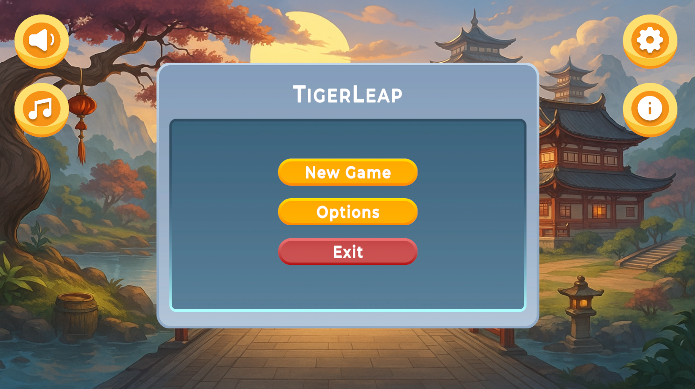
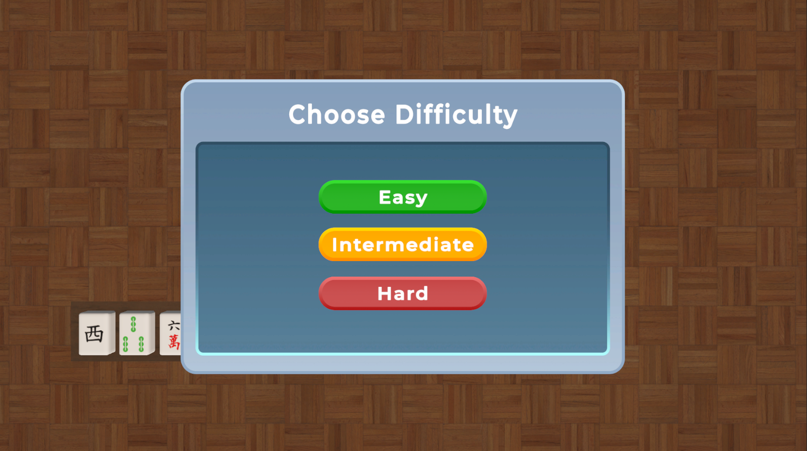

# TigerLeap Card Memory Game

A challenging 3D memory card matching game built with Unity, where players must find pairs of cards matching their hand cards within time limits. Features advanced audio management, Feel feedback system integration, and polished UI/UX design.

## Demo & Screenshots


*Main gameplay showing the 5x9 card grid and player hand*


*Difficulty selection screen*

### 🎮 [Live Demo](https://your-demo-link.com) | 📦 [Download Latest Release](https://github.com/vishalpandey2311/TigerLeap-Game/releases)

## Table of Contents
- [Demo & Screenshots](#demo--screenshots)
- [Game Overview](#game-overview)
- [Features](#features)
- [How to Play](#how-to-play)
- [Difficulty Levels](#difficulty-levels)
- [Controls](#controls)
- [Technical Implementation](#technical-implementation)
- [Architecture & Design Patterns](#architecture--design-patterns)
- [Scripts Overview](#scripts-overview)
- [Audio System](#audio-system)
- [Feel Integration](#feel-integration)
- [Installation](#installation)
- [System Requirements](#system-requirements)
- [Development Setup](#development-setup)
- [Code Quality & Standards](#code-quality--standards)
- [Performance Optimization](#performance-optimization)
- [Contributing](#contributing)
- [Troubleshooting](#troubleshooting)
- [API Documentation](#api-documentation)
- [Changelog](#changelog)
- [License](#license)

## Game Overview

TigerLeap is a memory-based card matching game where players are given a hand of 3 cards and must find matching pairs from a 5x9 grid of face-down cards. The game combines memory skills with time pressure to create an engaging and challenging experience.

### Core Mechanics
- **Memory Phase**: 10-second initial viewing period to memorise card positions
- **Matching Phase**: Find pairs matching your hand cards before time runs out
- **Collection System**: Successfully matched cards move to a collection grid
- **Scoring**: Track attempts and completion time
- **Dynamic Feedback**: Real-time audio and visual feedback system

## Features

### Game Features
- 🎯 Three difficulty levels (Easy, Intermediate, Hard)
- ⏱️ Time-based challenges with countdown timers
- 🃏 Dynamic card generation with unique hand cards
- 🎵 Advanced audio system with Feel integration
- ⏸️ Pause/Resume functionality with state management
- 📊 Performance tracking (attempts and time)
- 🏆 Win/Loss detection with appropriate feedback
- 🔊 Global sound management with persistent settings
- 🎮 Feel framework integration for enhanced user experience

### Technical Features
- **Modular Architecture**: Clean separation of concerns with singleton patterns
- **Advanced Audio Management**: Multi-layered audio system with MMSoundManager integration
- **Feel Feedback System**: Professional animations and feedback using More Mountains Feel
- **State Management**: Robust game state handling with proper transitions
- **Memory Optimization**: Efficient card spawning and collection systems
- **Cross-Platform Support**: Windows, macOS, and Linux compatibility
- **Persistent Settings**: Sound preferences saved across sessions
- **Event-Driven Architecture**: Decoupled systems using Unity Events and Feel events

### Visual Features
- 3D card flip animations with Feel framework
- Smooth card movement to the collection grid
- Visual completion indicators with checkmarks
- Professional UI with multiple panels
- Responsive button interactions with audio feedback
- Dynamic countdown display with visual emphasis

## How to Play

### Getting Started
1. **Launch Game**: Start the application to see the difficulty selection screen
2. **Choose Difficulty**: Select Easy (5 min), Intermediate (3 min), or Hard (1 min)
3. **Audio Settings**: Use the global sound toggle if needed
4. **Read Instructions**: Review the "How to Play" panel if needed

### Gameplay Flow
1. **Initialization Phase**:
   - Game spawns 45 cards in a 5x9 grid
   - 3 unique hand cards are selected and displayed
   - Collection grid is prepared for matched pairs

2. **Memorization Phase** (10 seconds):
   - All cards are face-up, showing their designs
   - Study the positions of cards matching your hand (bottom of screen)
   - Use this time to plan your strategy
   - Audio feedback indicates phase transitions

3. **Game Phase**:
   - Cards flip face-down automatically after 10 seconds
   - Click cards to flip them and find matches
   - Successfully matched cards move to the collection grid with animations
   - Audio feedback for correct/incorrect matches
   - Continue until all hand cards are matched or time runs out

4. **Completion**:
   - **Win**: Match all cards before time expires with victory audio
   - **Lose**: Time runs out before completing all matches with appropriate feedback

### Hand Cards
- Located at the bottom of the screen
- Shows 3 unique cards you need to find pairs for
- Each card type has exactly 4 copies in the grid (12 total matching cards)
- Cards remain visible throughout the game for reference
- Static display with disabled colliders for performance

## Difficulty Levels

| Difficulty | Time Limit | Challenge Level | Target Audience |
|------------|------------|-----------------|-----------------|
| **Easy** | 5 minutes | Beginner-friendly with generous time | New players, casual gaming |
| **Intermediate** | 3 minutes | Moderate challenge for regular players | Experienced players |
| **Hard** | 1 minute | Maximum challenge for expert players | Expert players, speedrun attempts |

## Controls

### Mouse Controls
- **Left Click**: Flip cards, interact with UI buttons
- **Pause Button**: Top-center of screen during gameplay
- **Sound Toggle**: Global audio control

### UI Navigation
- **Pause Menu**: Resume, Info, or Quit options
- **Win/Loss Screens**: Play Again or Exit options
- **Info Button**: Access instructions during pause
- **Sound Control**: Persistent audio settings

## Technical Implementation

### Technology Stack
- **Engine**: Unity 2022.3 LTS
- **Language**: C# (.NET Framework)
- **Graphics**: Universal Render Pipeline (URP)
- **Audio**: Unity Audio System + MMSoundManager
- **Animation**: More Mountains Feel Framework
- **Platform**: Windows, macOS, Linux
- **Architecture**: Singleton + Event-Driven patterns

### Core Dependencies
- **Feel Framework**: Advanced feedback and animation system
- **MMSoundManager**: Professional audio management
- **Unity Events**: Decoupled communication system
- **Coroutines**: Smooth animations and transitions

## Architecture & Design Patterns

### Design Patterns Used
1. **Singleton Pattern**
   - `AudioManager`: Global audio control
   - `PersistentSoundManager`: Cross-scene audio settings
   - `GameManager`: Central game state management

2. **Observer Pattern**
   - Unity Events for UI interactions
   - Feel event system for animations
   - Audio event triggers

3. **Component Pattern**
   - Modular card controllers
   - Specialized hand card behavior
   - UI panel management

4. **State Machine Pattern**
   - Game state transitions (Menu → Game → Pause → End)
   - Card states (Face-up → Face-down → Matched)

### System Architecture
```
GameManager (Central Hub)
    ├── CardSpawner (Grid Management)
    │   ├── CardController (Individual Cards)
    │   └── PlayerHandCardController (Hand Display)
    ├── AudioManager (Sound Control)
    │   ├── PersistentSoundManager (Settings)
    │   └── UniversalSoundController (Global Control)
    └── UIManager (Interface Management)
```

## Scripts Overview

### Core Scripts

#### `GameManager.cs`
- **Purpose**: Central game controller and state management
- **Key Features**:
  - Game state transitions with proper cleanup
  - Timer management with visual countdown
  - Score tracking and performance metrics
  - Audio coordination with Feel integration
  - UI panel management and transitions
  - Win/Loss condition detection
  - Pause/Resume functionality

#### `CardSpawner.cs`
- **Purpose**: Card generation and grid management system
- **Key Features**:
  - 5x9 grid layout with configurable spacing
  - Intelligent hand card selection (3 unique types)
  - Deck preparation ensuring exactly 4 copies per hand card
  - Collection grid positioning with 4x3 layout
  - Player hand display with proper positioning
  - Memory optimization for large grids

#### `CardController.cs`
- **Purpose**: Individual card behavior and Feel integration
- **Key Features**:
  - Smooth flip animations using Feel framework
  - Click detection with proper state management
  - Match validation against player's hand
  - Automatic state transitions (face-up → face-down)
  - Movement animation to collection grid
  - Audio feedback integration
  - Feel animation components setup

#### `PlayerHandCardController.cs`
- **Purpose**: Specialized controller for player hand cards
- **Key Features**:
  - Static display with no interaction
  - Collider disabled for performance
  - Always face-up orientation
  - Reference point for match validation
  - Visual distinction from grid cards

#### `AudioManager.cs`
- **Purpose**: Comprehensive audio management system
- **Key Features**:
  - Singleton pattern with DontDestroyOnLoad
  - Dynamic audio source creation and pooling
  - Integration with PersistentSoundManager
  - MMSoundManager Feel system control
  - Volume and mute controls with persistence
  - Button click sound system
  - Multiple audio tracks (Master, Music, SFX, UI)

#### `PersistentSoundManager.cs`
- **Purpose**: Cross-scene audio settings management
- **Features**:
  - Settings persistence using PlayerPrefs
  - Global sound state management
  - Scene transition audio continuity

#### `UniversalSoundController.cs`
- **Purpose**: Global audio control interface
- **Features**:
  - Universal sound toggle functionality
  - Integration with all audio systems
  - User preference management

#### `UIManager.cs`
- **Purpose**: User interface management and coordination
- **Features**:
  - Panel state management
  - Button interaction handling
  - Visual feedback coordination
  - Audio integration for UI elements

### Data Flow Architecture
1. **Initialization**: GameManager → CardSpawner → Individual Cards → Audio Setup
2. **User Input**: CardController → GameManager → Audio/Visual Feedback → UI Updates
3. **Audio**: GameManager → AudioManager → MMSoundManager → Audio Output
4. **State Management**: GameManager ↔ All Systems with proper cleanup

## Audio System

### Advanced Audio Features
- **Multi-Track System**: Master, Music, SFX, UI tracks
- **Feel Integration**: MMSoundManager for professional audio
- **Persistent Settings**: Audio preferences saved across sessions
- **Dynamic Loading**: Runtime audio source creation
- **Performance Optimization**: Audio source pooling and recycling

### Sound Categories
- **Gameplay Sounds**:
  - Correct Match: Satisfying success feedback
  - Wrong Match: Gentle failure indication
  - Card Flip: Subtle interaction feedback
  - Collection: Cards moving to collection grid

- **UI Sounds**:
  - Button clicks with pitch variation
  - Panel transitions
  - Menu navigation feedback

- **Game State Sounds**:
  - Game Win: Celebratory victory theme
  - Game Loss: Appropriate failure sound
  - Countdown: Tension-building background music
  - Pause/Resume: State transition feedback

### Audio Technical Implementation
```csharp
// Example of audio integration
AudioManager.Instance.Play("correctMatch");
MMSoundManagerTrackEvent.Trigger(MMSoundManagerTrackEventTypes.SetVolumeTrack, 
    MMSoundManager.MMSoundManagerTracks.Sfx, volume);
```

## Feel Integration

### Feel Framework Features
- **MMF_Player**: Centralized feedback management
- **Animation Springs**: Smooth card rotation and movement
- **Audio Integration**: Seamless MMSoundManager integration
- **Visual Feedback**: Enhanced user experience with professional animations

### Feel Components Used
- **Rotation Springs**: Card flip animations
- **Position Animations**: Card movement to collection
- **Audio Feedback**: Sound effect triggers
- **UI Animations**: Button and panel transitions

## Installation

### Quick Start (Players)
1. **Download**: Get the latest release from the [Releases page](https://github.com/vishalpandey2311/TigerLeap-Game/releases)
2. **Extract**: Unzip the downloaded file to your desired location
3. **Run**: Execute `TigerLeap-Game.exe` (Windows) or equivalent for your platform
4. **Configure**: Adjust audio settings as needed
5. **Play**: Select difficulty and start playing!

### System Requirements

#### Minimum Requirements
- **OS**: Windows 10, macOS 10.14, or Ubuntu 18.04
- **RAM**: 4 GB
- **Storage**: 500 MB available space
- **Graphics**: DirectX 11 compatible
- **Audio**: Integrated sound card
- **Unity**: Runtime components (included)

#### Recommended Requirements
- **OS**: Windows 11, macOS 12+, or Ubuntu 20.04+
- **RAM**: 8 GB or more
- **Storage**: 1 GB available space
- **Graphics**: Dedicated graphics card
- **Audio**: Dedicated sound card for enhanced audio experience

## Development Setup

### Prerequisites
- **Unity**: 2022.3 LTS or later
- **IDE**: Visual Studio 2022 or Visual Studio Code with C# extension
- **Git**: For version control
- **Feel Framework**: More Mountains Feel (included in project)

### Getting Started
1. **Clone the repository**:
   ```bash
   git clone https://github.com/vishalpandey2311/TigerLeap-Game.git
   cd TigerLeap-Game
   ```

2. **Open in Unity**:
   - Launch Unity Hub
   - Click "Add" and select the cloned folder
   - Open the project with Unity 2022.3 LTS
   - Allow Unity to import Feel framework

3. **Setup Feel Framework**:
   - Ensure MMSoundManager is properly configured
   - Verify Feel components are functioning
   - Test audio system integration

4. **Build and Run**:
   - File → Build Settings
   - Select your target platform
   - Configure platform-specific settings
   - Click "Build and Run"

### Project Structure
```
Assets/
├── Scripts/                    # C# game logic
│   ├── AudioManager.cs        # Audio system management
│   ├── CardController.cs      # Individual card behavior
│   ├── CardSpawner.cs         # Grid and card generation
│   ├── GameManager.cs         # Central game control
│   ├── PlayerHandCardController.cs # Hand card management
│   ├── PersistentSoundManager.cs  # Cross-scene audio
│   ├── UIManager.cs           # Interface management
│   └── UniversalSoundController.cs # Global audio control
├── Feel/                      # More Mountains Feel Framework
│   ├── MMFeedbacks/          # Feedback system components
│   ├── MMTools/              # Audio and utility tools
│   └── Core/                 # Feel framework core
├── Prefabs/                  # Card and UI prefabs
├── Materials/                # Card textures and materials
├── Audio/                    # Sound effects and music
├── Scenes/                   # Game scenes
└── UI/                      # User interface assets
```

## Code Quality & Standards

### Coding Standards
- **C# Conventions**: Following Microsoft C# coding standards
- **Unity Patterns**: Proper MonoBehaviour usage and lifecycle management
- **Feel Integration**: Proper MMF component usage and event handling
- **Error Handling**: Comprehensive null checks and exception handling
- **Performance**: Optimized for 60 FPS target with efficient memory usage

### Documentation Standards
- **XML Documentation**: Comprehensive method and class documentation
- **Inline Comments**: Complex algorithms and Feel integrations explained
- **README**: Detailed project documentation
- **API Documentation**: Feel integration and custom systems documented

### Testing Standards
- **Unit Testing**: Core game logic validation
- **Integration Testing**: Feel system integration verification
- **Performance Testing**: Memory and FPS optimization validation
- **Platform Testing**: Multi-platform compatibility verification

## Performance Optimization

### Memory Management
- **Object Pooling**: Efficient card and audio source reuse
- **Singleton Patterns**: Controlled instance creation
- **Proper Cleanup**: Event unsubscription and resource disposal
- **Feel Optimization**: Efficient feedback component usage

### Runtime Performance
- **60 FPS Target**: Optimized for smooth gameplay
- **Efficient Animations**: Feel framework optimization
- **Audio Optimization**: Source pooling and dynamic loading
- **UI Optimization**: Efficient panel management

### Build Optimization
- **Asset Compression**: Optimized texture and audio compression
- **Code Stripping**: Unused code removal
- **Platform-Specific**: Optimized builds for each target platform

## Contributing

We welcome contributions! Please see our [Contributing Guidelines](CONTRIBUTING.md) for details.

### Development Workflow
1. **Feature Development**: Create feature branches from main
2. **Feel Integration**: Ensure proper Feel framework usage
3. **Testing**: Test on multiple platforms with audio verification
4. **Code Review**: Review pull requests for quality and standards
5. **Integration**: Merge to main branch with proper testing
6. **Release**: Create releases with comprehensive testing

### Contribution Areas
- **Audio System**: Enhanced sound effects and music
- **Feel Integration**: Advanced animations and feedback
- **UI/UX**: Interface improvements and accessibility
- **Performance**: Optimization and cross-platform compatibility
- **Documentation**: Technical documentation and tutorials

## Troubleshooting

### Common Issues

#### Audio Not Playing
- **Symptoms**: No sound effects or music
- **Solutions**:
  - Check global sound toggle in game
  - Verify system volume and mute settings
  - Ensure audio drivers are properly installed
  - Check PersistentSoundManager settings
  - Verify MMSoundManager configuration

#### Feel Framework Issues
- **Symptoms**: Animations not playing, feedback not working
- **Solutions**:
  - Verify Feel components are properly configured
  - Check MMF_Player components on cards
  - Ensure Feel authorization settings are enabled
  - Validate event system integration

#### Cards Not Responding
- **Symptoms**: Click detection issues
- **Solutions**:
  - Ensure the game is not paused
  - Wait for the initial countdown to complete
  - Check mouse/input device functionality
  - Verify collider configuration on cards

#### Performance Issues
- **Symptoms**: Low FPS, stuttering
- **Solutions**:
  - Close other applications to free memory
  - Check system meets minimum requirements
  - Reduce screen resolution if needed
  - Verify Feel components are optimized

### Advanced Troubleshooting

#### Audio System Debug
```csharp
// Debug audio system status
Debug.Log($"AudioManager Instance: {AudioManager.Instance != null}");
Debug.Log($"Global Sound Enabled: {PersistentSoundManager.Instance?.IsGlobalSoundEnabled()}");
Debug.Log($"AudioListener Volume: {AudioListener.volume}");
```

#### Feel System Debug
- Check MMF_Player components in inspector
- Verify feedback authorization in MMFeedbacksAuthorizations
- Test individual feedback components

## API Documentation

### Core Classes

#### AudioManager
```csharp
public class AudioManager : MonoBehaviour
{
    public static AudioManager Instance { get; }
    public void Play(string soundName);
    public void PlayButtonClick();
    public bool IsGlobalSoundEnabled();
    public void SetVolume(float volume);
    public void ToggleMute();
}
```

#### CardController
```csharp
public class CardController : MonoBehaviour
{
    public int cardTypeId { get; set; }
    public bool isFlipped { get; }
    public bool isMatched { get; }
    // Feel integration methods
    private void SetupFeelComponents();
    private IEnumerator FlipCardWithFeel();
}
```

#### GameManager
```csharp
public class GameManager : MonoBehaviour
{
    public GameState currentState { get; }
    public float timeRemaining { get; }
    public int attemptCount { get; }
    public void PauseGame();
    public void ResumeGame();
    public void RestartGame();
}
```

### Events System
- Unity Events for UI interactions
- Feel events for animations and feedback
- Custom events for game state changes
- Audio events for sound management

## Changelog

### v1.0.0 (Current)
- **Core Features**:
  - Complete game implementation with 5x9 grid
  - Three difficulty levels with time management
  - Advanced audio system with Feel integration
  - Persistent sound settings across sessions

- **Technical Features**:
  - Singleton pattern implementation for managers
  - Feel framework integration for professional feedback
  - MMSoundManager integration for advanced audio
  - Cross-platform compatibility (Windows, macOS, Linux)

- **Audio System**:
  - Multi-track audio management
  - Global sound toggle with persistence
  - Feel integration for enhanced feedback
  - Button click sounds and UI audio

- **Performance**:
  - Optimized for 60 FPS gameplay
  - Efficient memory management
  - Object pooling for audio sources
  - Proper resource cleanup

See [CHANGELOG.md](CHANGELOG.md) for detailed version history.

## Roadmap

### v1.1.0 (Planned)
- **Enhanced Audio**:
  - Dynamic music system
  - Advanced sound effect variations
  - Audio accessibility options

- **Feel Enhancements**:
  - Advanced card flip animations
  - Particle effects for matches
  - Enhanced UI transitions

### v1.2.0 (Future)
- **Gameplay Features**:
  - Leaderboards and score tracking
  - Additional card themes and designs
  - Custom difficulty settings

- **Technical Improvements**:
  - Save system for game progress
  - Enhanced performance optimization
  - Mobile platform support

### v2.0.0 (Long-term)
- **Advanced Features**:
  - Multiplayer support
  - Achievement system
  - Level editor

- **Platform Expansion**:
  - Steam integration
  - Console platform support
  - VR/AR experimental mode

## Performance & Analytics

### Technical Specifications
- **Build Size**: ~200MB (including Feel framework)
- **Memory Usage**: ~300MB during gameplay (including audio)
- **Startup Time**: < 5 seconds on recommended hardware
- **Target FPS**: 60 FPS on all supported platforms
- **Audio Latency**: < 50ms for immediate feedback

### Optimization Metrics
- **Draw Calls**: Optimized for minimal overdraw
- **Memory Allocation**: Minimal GC allocation during gameplay
- **Audio Performance**: Efficient source pooling and management
- **Feel Performance**: Optimized feedback component usage

## License

This project is developed as an educational assignment. All rights reserved.

### Third-Party Assets
- **Unity Engine**: [Unity Personal License](https://unity3d.com/legal/licenses/Unity_Personal_General_License)
- **More Mountains Feel**: [Feel Framework License](https://feel-docs.moremountains.com/)
- **Audio Assets**: Custom-created or royalty-free sources
- **Card Graphics**: Original artwork and design

### Open Source Components
- Unity Events system
- C# standard libraries
- Cross-platform compatibility layers

## Acknowledgments

- **Unity Technologies**: For the comprehensive game engine
- **More Mountains**: For the exceptional Feel framework
- **Unity Community**: For tutorials, documentation, and support
- **Beta Testers**: For valuable feedback and bug reports
- **Audio Engineers**: For sound design consultation
- **UI/UX Designers**: For interface design guidance

## Contact & Support

**Developer**: Vishal Pandey  
**GitHub**: [@vishalpandey2311](https://github.com/vishalpandey2311)  
**Project Link**: [https://github.com/vishalpandey2311/TigerLeap-Game](https://github.com/vishalpandey2311/TigerLeap-Game)  
**Documentation**: [Wiki](https://github.com/vishalpandey2311/TigerLeap-Game/wiki)

### Support Channels
- 📝 [Issues](https://github.com/vishalpandey2311/TigerLeap-Game/issues) - Bug reports and feature requests
- 💬 [Discussions](https://github.com/vishalpandey2311/TigerLeap-Game/discussions) - Community discussion
- 📚 [Wiki](https://github.com/vishalpandey2311/TigerLeap-Game/wiki) - Detailed documentation
- 🎮 [Releases](https://github.com/vishalpandey2311/TigerLeap-Game/releases) - Download latest version

---

*TigerLeap Card Memory Game - Professional Unity game development with Feel framework integration*

⭐ **Found this project helpful? Give it a star!** ⭐

[](https://unity.com/)
[](https://feel-docs.moremountains.com/)
[](https://docs.microsoft.com/en-us/dotnet/csharp/)
[](LICENSE)
